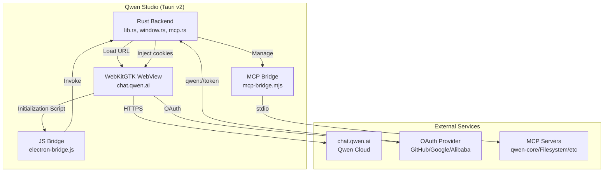
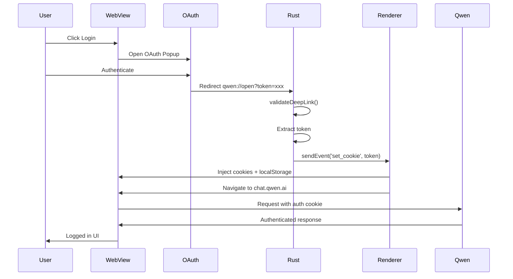

# Qwen Studio for Linux

[](https://github.com/youssefvdel/qwen-studio/releases)
[](LICENSE)
[](https://github.com/youssefvdel/qwen-studio/releases)
[](https://github.com/youssefvdel/qwen-studio/stargazers)

Open-source Qwen AI desktop client for Linux. Run Alibaba's Qwen models natively with full MCP (Model Context Protocol) support and automatic updates.

**v2.2.0 — Migrated to Tauri v2 (Rust + WebKitGTK)**: ~6MB binary (was ~150MB Electron), better performance, native Linux integration.

The official Qwen Studio app only supports Windows and macOS. This project brings the same desktop experience to Linux.

---

## Quick Install

### Option 1: Debian/Ubuntu (recommended)

```bash
wget https://github.com/youssefvdel/qwen-studio/releases/latest/download/qwen-studio_2.2.2_amd64.deb
sudo apt install ./qwen-studio_2.2.2_amd64.deb
qwen-studio
```

### Option 2: Fedora/RHEL

```bash
wget https://github.com/youssefvdel/qwen-studio/releases/latest/download/qwen-studio-2.2.2.x86_64.rpm
sudo dnf install qwen-studio-2.2.2.x86_64.rpm
qwen-studio
```

[All Downloads](https://github.com/youssefvdel/qwen-studio/releases)

---

## Features

| Feature             | Description                                                                          |
| ------------------- | ------------------------------------------------------------------------------------ |
| Full Qwen AI access | Native desktop wrapper for chat.qwen.ai — supports Qwen3.6-Plus, Qwen-Max, Qwen-Plus |
| MCP integration     | Connect AI to files, browser, databases, and custom tools via Model Context Protocol |
| System tray         | Minimize to tray, right-click menu, runs in background                               |
| 12 languages        | zh-CN, en-US, zh-TW, ja-JP, ko-KR, ru-RU, de-DE, fr-FR, es-ES, it-IT, pt-PT, ar-BH   |
| Theme support       | Light/dark mode with automatic system theme detection                                |
| Auto updates        | In-app update notifications with one-click install (DEB, RPM)                        |
| Zoom controls       | **Ctrl+Scroll**, **Ctrl+±**, **Ctrl+0** (50%-200% range)                             |
| Deep linking        | `qwen://` protocol support for authentication and sharing                            |
| Privacy first       | Sandboxed WebView, no telemetry, zero data collection                                |
| Tauri v2            | Rust backend + WebKitGTK — ~6MB binary, native Linux performance                     |

---

## Architecture

Built with **Tauri v2** (Rust + WebKitGTK):



### Module Structure

| Module              | Purpose                                          |
| ------------------- | ------------------------------------------------ |
| `src/lib.rs`    | App bootstrap, WebView, updates, zoom          |
| `src/main.rs`   | Binary entry point                               |
| `src/window.rs` | Window management, deep links            |
| `src/mcp.rs`    | MCP server management, tool calls                |
| `src/dialogs.rs`| Native file picker, confirmation dialogs         |
| `src/events.rs` | Event forwarding between Rust and WebView        |
| `src/settings.rs`| Settings storage (JSON)                         |
| `src/tray.rs`   | System tray setup                                |
| `src/menu.rs`   | GTK HeaderBar menu (Linux)                       |
| `electron-bridge.js` | JS bridge injected into WebView            |
| `mcp-bridge.mjs`| MCP proxy server (Node.js)                       |

### Authentication Flow



---

## Development

### Prerequisites

- Node.js 22+
- Rust stable toolchain
- Linux development libraries:
  - **Debian/Ubuntu:** `sudo apt install libwebkit2gtk-4.1-dev libappindicator3-dev librsvg2-dev patchelf`
  - **Fedora:** `sudo dnf install gtk3-devel webkit2gtk4.1-devel libappindicator-gtk3-devel librsvg2-devel`
  - **Arch:** `sudo pacman -S webkit2gtk-4.1 libappindicator-gtk3 librsvg`

### Install & Run

```bash
git clone https://github.com/youssefvdel/qwen-studio.git
cd qwen-studio
npm install
npm run tauri:dev
```

### Build Packages

```bash
# All formats
npm run tauri:build

# Individual formats
npm run tauri:build:deb    # Debian/Ubuntu
npm run tauri:build:rpm    # Fedora/RHEL
npm run tauri:build:appimage   # Universal AppImage
```

### Build on Windows

Windows-сборка идёт через отдельный CI-workflow [`.github/workflows/windows-build.yml`](.github/workflows/windows-build.yml) (`windows-latest` + MSVC, бандлы `.exe` NSIS и `.msi` WiX). Запустить можно вручную через **Actions → Windows Build → Run workflow**.

Локально на Windows:

```powershell
# Требования: Node.js 22+, Rust stable (MSVC target), Visual Studio 2022 Build Tools (C++)
npm install
npm run tauri:build:win    # tauri build --bundles nsis,msi
```

Артефакты: `target/release/bundle/nsis/*.exe`, `target/release/bundle/msi/*.msi`.

> GTK-зависимости (`gtk`, `glib`) подключаются только под Linux (`cfg(target_os = "linux")`), поэтому на Windows они не линкуются. Updater-подписи (`.sig`) требуют `TAURI_SIGNING_PRIVATE_KEY`; в CI без секрета `createUpdaterArtifacts` отключается автоматически.

### Code Quality

```bash
cargo clippy -- -D warnings   # MUST pass
cargo check
cargo fmt
```

### Project Structure

```
qwen-studio/
├── src/
│   ├── lib.rs         # Tauri setup, WebView, update commands
│   ├── main.rs        # Binary entry point
│   ├── window.rs      # Window management, deep links
│   ├── mcp.rs         # MCP server management
│   ├── dialogs.rs     # Native dialogs
│   ├── events.rs      # Event forwarding
│   ├── settings.rs    # Settings storage
│   ├── tray.rs        # System tray
│   └── menu.rs        # GTK HeaderBar menu
│   ├── tauri.conf.json    # Tauri configuration
│   ├── Cargo.toml         # Rust dependencies
│   ├── electron-bridge.js # JS bridge injected into WebView
│   └── mcp-bridge.mjs     # MCP proxy server
├── docs/                  # Architecture docs, studies
├── package.json
└── qwen-studio.desktop
```

---

## MCP Configuration

### Available MCP Servers

| Server              | Capability                                      |
| ------------------- | ----------------------------------------------- |
| qwen-core           | 28 tools: file ops, search, bash, time, agents  |
| Filesystem          | Read, write, search, list files                 |
| Fetch               | Access web APIs and URLs from chat              |
| Sequential-Thinking | Multi-step reasoning                            |
| Desktop-Commander   | Run shell commands, manage processes            |
| SQLite/PostgreSQL   | Query databases from chat                       |

### Example Config

Default MCP servers are created on first launch. Customize via the app's settings:

```json
{
  "mcpServers": {
    "qwen-core": {
      "command": "npx",
      "args": ["-y", "qwen-core"],
      "transportType": "stdio"
    }
  }
}
```

Config location: `~/.config/qwen-studio/settings.json`

---

## Auto Updates

The app checks for updates on startup and every 4 hours. When an update is available:
- A popup notification appears (top-right corner)
- Click **View** to navigate to the Settings Updates tab
- Download with progress tracking → Install → Restart

**Settings Updates Tab:**
- Manual "Check for Updates" button
- Real-time download progress (MB counter)
- Release notes viewer
- One-click restart after install

Supported install types:
- **DEB**: Downloads via curl → `pkexec dpkg -i` → restart
- **RPM**: Downloads via curl → `pkexec rpm -Uvh` → restart

---

## Internationalization

zh-CN, en-US, zh-TW, ja-JP, ko-KR, ru-RU, de-DE, fr-FR, es-ES, it-IT, pt-PT, ar-BH

---

## Security

| Layer             | Implementation                            |
| ----------------- | ----------------------------------------- |
| WebView Sandbox   | WebKitGTK runs in isolated process        |
| IPC Only          | All communication through typed channels  |
| MCP Validation    | Only configured servers can connect       |
| No Telemetry      | Zero data collection                      |
| Deep Link Auth    | Token validation before injection         |

---

## Known Issues

| Issue                      | Status           | Workaround                                                                                                                                                                                                                                                                                                               |
| -------------------------- | ---------------- | ------------------------------------------------------------------------------------------------------------------------------------------------------------------------------------------------------------------------------------------------------------------------------------------------------------------------ |
| WebKitGTK blank screen     | Known            | `WEBKIT_DISABLE_COMPOSITING_MODE=1 WEBKIT_DISABLE_DMABUF_RENDERER=1` (set automatically in package.json)                                                                                                                                                                                                                 |
| Wayland compositors        | Partial          | `GDK_BACKEND=x11` (set automatically)                                                                                                                                                                                                                                                                                    |
| Browser login redirect     | Open             | Login via the in-app window. If external browser opens, copy `qwen://open?token=xxx` URL and run `xdg-open "qwen://open?token=YOUR_TOKEN"` in terminal. Known limitation with protocol handlers on some desktop environments.                                                                                           |
| MCP settings page network error | Expected    | Web app tries cloud backend. Local Tauri MCP handles everything. Do not fix.                                                                                                                                                                                                                                             |

---

## Debugging

```bash
cat ~/.config/qwen-studio/settings.json | python3 -m json.tool  # Check MCP config
/usr/bin/qwen-studio 2>&1 | tee /tmp/qwen-studio.log            # Runtime logs
npx qwen-core                                                    # Test MCP directly
rm -rf ~/.config/qwen-studio/ && npm run tauri:dev              # Clean state test
```

---

## Contributing

Contributions welcome.

1. Fork the repository
2. Create a feature branch (`git checkout -b feature/your-feature`)
3. Commit your changes
4. Push and open a Pull Request

What we need:

- Translations for additional languages
- Bug reports and fixes
- Documentation improvements
- UI/UX enhancements
- Testing on different distros

---

## License

MIT License. See [LICENSE](LICENSE).

---

## Documentation

- [Architecture](docs/ARCHITECTURE.md) - System design and module structure
- [Agent Brain](docs/AGENT_BRAIN.md) - Quick reference for developers
- [Official App Analysis](docs/OFFICIAL_APP_ANALYSIS.md) - Reverse-engineered Electron app
- [MCP Domain Analysis](docs/MCP_DOMAIN_ANALYSIS.md) - API endpoints and limitations
- [Native TUI Study](docs/NATIVE_TUI_STUDY.md) - Proposal for native terminal client
- [Security Audit](docs/SECURITY_AUDIT.md) - Security review and recommendations
- [Parent ID Error Study](docs/PARENT_ID_ERROR_STUDY.md) - IndexedDB error analysis

---

## Acknowledgments

- Based on reverse engineering of the official Qwen Studio app (Windows/macOS)
- Uses [`@modelcontextprotocol/sdk`](https://github.com/modelcontextprotocol/typescript-sdk) by Anthropic
- Built with [Tauri v2](https://v2.tauri.app/) (Rust + WebKitGTK)
- v2.2.0 migrates from Electron to Tauri for better performance and smaller binaries

---

Keywords: Qwen AI Linux, Qwen Studio Linux, Tongyi Qianwen Linux, open source Qwen, free Qwen AI desktop, Alibaba Qwen Linux client, Qwen MCP Linux, Qwen3 Linux app, Qwen chat desktop Linux, Ubuntu Qwen AI, Fedora Qwen, Arch Linux Qwen, Tauri Qwen app
